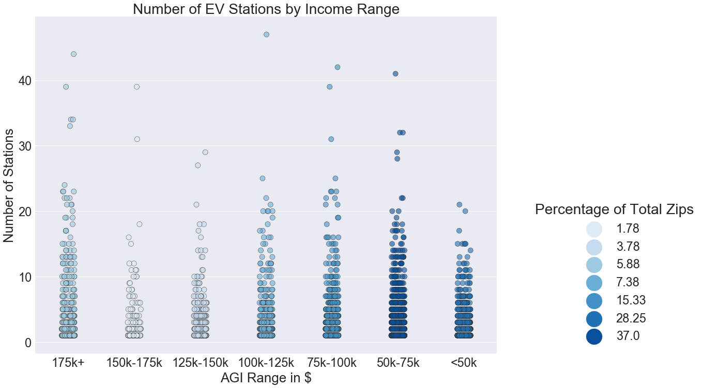
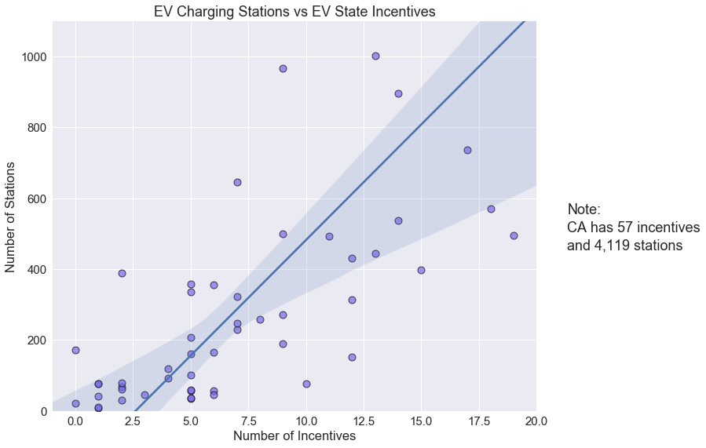
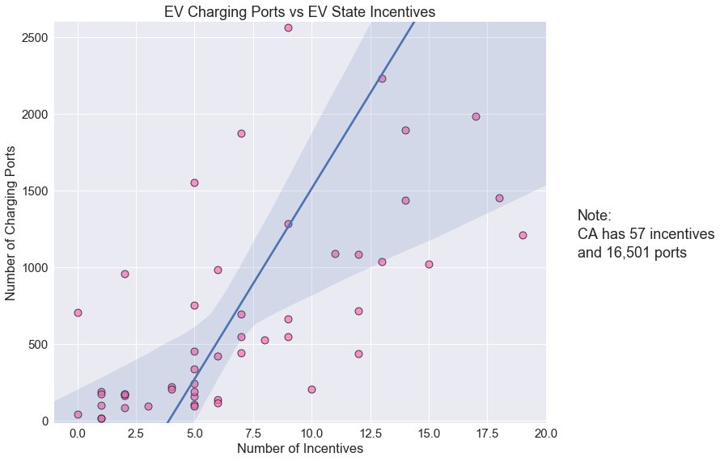
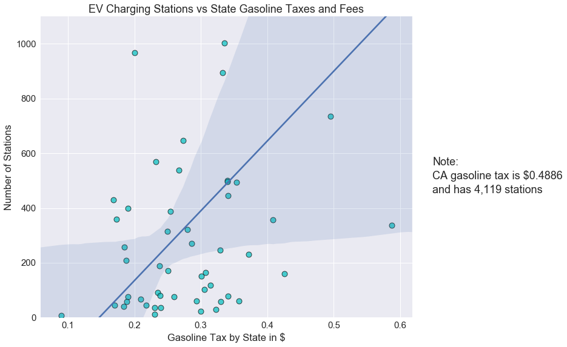
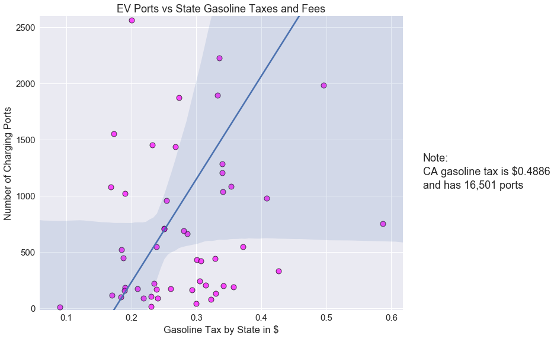

# An Investigation into Electric Vehicle Charging Stations


## Do these three factors affect the concentration and location of Electric Vehicle (EV) charging stations?

- Average Adjusted Gross Income (AGI) by Zip Code
- State EV incentives
- State Gasoline Taxes


```python
#dependencies
import pandas as pd
import numpy as np
import seaborn as sns
import matplotlib.pyplot as plt
import plotly.plotly as py

from plotly.graph_objs import *
from config import (mboxkey, plykey, plyname)
```


```python
#read the csvs into a df
station_agi_df = pd.read_csv('Output/station_agi_df.csv')
nz_stn_agi_df = pd.read_csv('Output/nz_stn_agi_df.csv')
stn_agi_bin_df = pd.read_csv('Output/stn_agi_bin_df.csv')
state_inc_df = pd.read_csv('Output/Incentives by State.csv')
gas_df = pd.read_csv('Output/gas_df.csv')
```

## EV Stations and Ports vs AGI by Zip Code

### EV Charging Stations with Average AGI by Zip Code Scattermap


```python
#make scattermap

#set up mapbox token
mapbox_access_token = mboxkey

#make variables
site_lat = nz_stn_agi_df['Stn Lat']
site_lon = nz_stn_agi_df['Stn Lng']
agi = nz_stn_agi_df['formatted_agi']
zip_code = nz_stn_agi_df['Zip Code']

#data
map_data = Data([
    Scattermapbox(
        lat=site_lat,
        lon=site_lon,
        mode='markers',
        marker=Marker(
            size=4,
            opacity=1,
            autocolorscale = False,
            colorscale = 'Portland',
            cmin = 25000,
            color = nz_stn_agi_df['Average AGI'],
            cmax = 150000,
            colorbar=dict(
                title="AGI"),
        ),
        text= 'AGI: '+ agi + ' | Zip Code: ' + zip_code.astype(str),
        hoverinfo='text'
    )]
)

#layout
map_layout = Layout(
    title='EV Charging Stations with Average AGI by Zip Code <br> (Hover for Average AGI)',
    autosize=True,
    hovermode='closest',
    showlegend=False,
    mapbox=dict(
        accesstoken=mapbox_access_token,
        bearing=0,
        center=dict(
            lat=38,
            lon=-94
        ),
        pitch=0,
        zoom=3,
        style='light'
    ),
)

#figure
fig = dict(data=map_data, layout=map_layout)

#plot
py.iplot(fig, filename='AGI Map')
```

    High five! You successfully sent some data to your account on plotly. View your plot in your browser at https://plot.ly/~VanessaVanG/0 or inside your plot.ly account where it is named 'AGI Map'
    


<iframe id="igraph" scrolling="no" style="border:none;" seamless="seamless" src="https://plot.ly/~VanessaVanG/0.embed" height="525px" width="100%"></iframe>


# [Plotly Map of Charging Stations vs. Avg AGI](https://plot.ly/~VanessaVanG/0/ev-charging-stations-with-average-agi-by-zip-code-hover-for-average-agi/)

### Number of EV Stations by Income Range Strip Plot


```python
#plot
plt.figure(figsize=(16,12))

sns.set(font_scale=2.35)

nd = np.arange(6)
width=0.5
sns.stripplot(x="AGI Range", y="Number of Stations", data=stn_agi_bin_df, palette="Blues", hue="Percentage of Total Zips", jitter=True, s=10, edgecolors="k", linewidth=.8, alpha=.6)
 
#make legend
plt.legend(loc='lower right', markerscale=4, title='Percentage of Total Zips', bbox_to_anchor=(1.45, 0))
 
#make titles
plt.xlabel('AGI Range in $')
plt.ylabel('Number of Stations')
plt.title('Number of EV Stations by Income Range')

plt.show()
```





## EV Stations and Ports vs Incentives by State

### State Incentives Choropleth


```python
#make variables
incentives = (state_inc_df['Number of Incentives'].astype(int)).astype(str)
stations = state_inc_df['Number of Stations'].astype(str)
ports = (state_inc_df['Number of Connectors'].astype(int)).astype(str)

#data
inc_data = [ dict(
        type='choropleth',
        colorscale = 'Greens',
        autocolorscale = False,
        reversescale = True,
        locations = state_inc_df['State'],
        z = state_inc_df['Number of Incentives'],
        locationmode = 'USA-states',
        text = 'State: ' + state_inc_df['State'] + '<br>' 
                + 'Incentives: ' + incentives + '<br>' 
                + 'Stations: ' + stations+ '<br>' 
                + 'Connector Ports: ' + ports,
        hoverinfo='text',
        marker = dict(
            line = dict (
                color = 'rgb(255,255,255)',
                width = 2
            ) ),
        colorbar = dict(
            title = 'Number of EV Incentives' + '<br>' + 'by State'),
        zmin = 1,
        zmax = 20
        ),
        
        #make another layer to show number of stations and ports
        dict(
        type = 'scattergeo',
        locations = state_inc_df['State'],
        locationmode = 'USA-states',
        text = 'S: ' + stations + '<br>' +  'P: ' + ports,
        mode = 'text',
        hoverinfo = 'none',
        textfont = dict(color=state_inc_df['text_color'])        
        )
       ]

inc_layout = dict(
        title = 'State EV Incentives with Number of Stations and Connector Ports',
        geo = dict(
            scope='usa',
            projection=dict( type='albers usa' ),
            showlakes = True,
            lakecolor = 'rgb(255, 255, 255)'),
             )
    
fig = dict( data=inc_data, layout=inc_layout )
py.iplot( fig, filename='EV_Incentives' )
```


<iframe id="igraph" scrolling="no" style="border:none;" seamless="seamless" src="https://plot.ly/~VanessaVanG/5.embed" height="525px" width="100%"></iframe>


# [Map of Charging Stations vs. State Incentives](http://plot.ly/~VanessaVanG/5/state-ev-incentives-with-number-of-stations-and-connector-ports/)

### EV Stations vs Incentives Regression Plot


```python
#make the font scale larger
sns.set(font_scale=1.5)

#make the plot
incentives_plot = sns.lmplot(x='Number of Incentives', y='Number of Stations', data=state_inc_df, 
                         fit_reg=True, scatter_kws={'s': 80, 'alpha':0.7, 'linewidths':1, 'color':'mediumslateblue','edgecolor':'k'},
                         size=8, aspect=1.25)

#change the x & y axes 
plt.xlim(-1, 20)
plt.ylim(0, 1100)

#set the title
plt.title('EV Charging Stations vs EV State Incentives')

#make a note on the side
incentives_plot.fig.text(1.02, .54, 'Note:')
incentives_plot.fig.text(1.02, .5, 'CA has 57 incentives')
incentives_plot.fig.text(1.02, .46, 'and 4,119 stations')

#save as a png
incentives_plot.savefig('Output/stations_vs_incentives.png')
                         
plt.show()
```





### EV Ports vs Incentives Regression Plot


```python
#make the font scale larger
sns.set(font_scale=1.5)

#make the plot
inc_port_plot = sns.lmplot(x='Number of Incentives', y='Number of Connectors', data=state_inc_df, 
                         fit_reg=True, scatter_kws={'s': 80, 'alpha':0.7, 'linewidths':1, 'color':'hotpink','edgecolor':'k'},
                         size=8, aspect=1.25)

#change the x & y axes 
plt.xlim(-1, 20)
plt.ylim(-15, 2600)
plt.ylabel('Number of Charging Ports')

#set the title
plt.title('EV Charging Ports vs EV State Incentives')

#make a note on the side
inc_port_plot.fig.text(1.02, .54, 'Note:')
inc_port_plot.fig.text(1.02, .5, 'CA has 57 incentives')
inc_port_plot.fig.text(1.02, .46, 'and 16,501 ports')

#save as a png
inc_port_plot.savefig('Output/ports_vs_incentives.png')
                         
plt.show()
```





## EV Stations and Ports vs Gasoline Taxes by State

### State Gasoline Taxes Choropleth


```python
#make variables for the text portion
tax = gas_df['State Tax'].astype(str)
station = gas_df['Number of Stations'].astype(str)
port = (gas_df['Number of Connectors'].astype(int)).astype(str)

#data
gas_data = [ dict(
        type='choropleth',
        colorscale = 'YlOrRd',
        autocolorscale = False,
        reversescale = True,
        locations = gas_df['State'],
        z = gas_df['State Tax'].astype(float),
        locationmode = 'USA-states',
        text = 'State: ' + gas_df['State'] + '<br>' 
                + 'Gas Tax: ' + tax + '<br>' 
                + 'Stations: ' + stations+ '<br>' 
                + 'Connector Ports: ' + ports,
        hoverinfo='text',
        marker = dict(
            line = dict (
                color = 'rgb(255,255,255)',
                width = 2
            ) ),
        colorbar = dict(
            title = 'State Gas Taxes' + '<br>' + 'in $'),
        ),
            
        #add another layer for number of stations and ports
        dict(
        type = 'scattergeo',
        locations = gas_df['State'],
        locationmode = 'USA-states',
        text = 'S: ' + stations + '<br>' +  'P: ' + ports,
        mode = 'text',
        hoverinfo = 'none',
        textfont = dict(color=gas_df['text_color'])
        )
       ]

gas_layout = dict(
        title = 'State Gasoline Taxes and Fees with' + '<br>' 
                + 'Number of Stations and Connector Ports',
        geo = dict(
            scope='usa',
            projection=dict( type='albers usa' ),
            showlakes = True,
            lakecolor = 'rgb(255, 255, 255)'),
             )
    
fig = dict( data =gas_data, layout = gas_layout )
py.iplot( fig, filename='EV_Tax' )
```


<iframe id="igraph" scrolling="no" style="border:none;" seamless="seamless" src="https://plot.ly/~VanessaVanG/9.embed" height="525px" width="100%"></iframe>


# [Map of State Gasoline Tax vs. Charging Stations](http://plot.ly/~VanessaVanG/9/state-gasoline-taxes-and-fees-with-number-of-stations-and-connector-ports/) 

### EV Stations vs State Gasoline Tax Regression Plot


```python
#make the font scale larger
sns.set(font_scale=1.5)

#make the plot
tax_stn_plot = sns.lmplot(x='State Tax', y='Number of Stations', data=gas_df, 
                         fit_reg=True, scatter_kws={'s': 80, 'alpha':0.7, 'linewidths':1, 'color':'c','edgecolor':'k'},
                         size=8, aspect=1.25)

#change the x and y axes 
plt.ylim(0, 1100)
plt.xlabel('Gasoline Tax by State in $')

#set the title
plt.title('EV Charging Stations vs State Gasoline Taxes and Fees')

#make a note on the side
tax_stn_plot.fig.text(1.02, .54, 'Note:')
tax_stn_plot.fig.text(1.02, .5, 'CA gasoline tax is $0.4886')
tax_stn_plot.fig.text(1.02, .46, 'and has 4,119 stations')

#save as a png
tax_stn_plot.savefig('Output/stations_vs_tax.png')
                         
plt.show()
```





### EV Ports vs State Gasoline Tax Regression Plot


```python
#make the font scale larger
sns.set(font_scale=1.5)

#make the plot
tax_port_plot = sns.lmplot(x='State Tax', y='Number of Connectors', data=gas_df, 
                         fit_reg=True, scatter_kws={'s': 80, 'alpha':0.7, 'linewidths':1, 'color':'fuchsia','edgecolor':'k'},
                         size=8, aspect=1.25)

#change the x and y axes 
plt.ylim(-15, 2600)
plt.ylabel('Number of Charging Ports')
plt.xlabel('Gasoline Tax by State in $')

#set the title
plt.title('EV Ports vs State Gasoline Taxes and Fees')

#make a note on the side
tax_port_plot.fig.text(1.02, .54, 'Note:')
tax_port_plot.fig.text(1.02, .5, 'CA gasoline tax is $0.4886')
tax_port_plot.fig.text(1.02, .46, 'and has 16,501 ports')

#save as a png
tax_port_plot.savefig('Output/ports_vs_tax.png')
                         
plt.show()
```





## Analysis

### Average AGI by Zip Code
 - there are more charging stations in the major metropolitan cities of the state: Silicon Valley, LA, New York, Austin, where most of the population live

### State incentives:
 - the line of regression shows that there is somewhat of a correlation between number of stations and number of incentives.

### State Gas Tax and Fees:
 - there is a weaker correlation here but still a small one


## Other factors we would consider for future investigation:
- Population density
- The number of charging stations throughout a period of time
- Number of electric cars purchased over time

### California is worth studying on its own due to its very high number of stations. If the influencing factors can be determined, they can possibly be applied in other states to increase the number of EV stations/EVs
